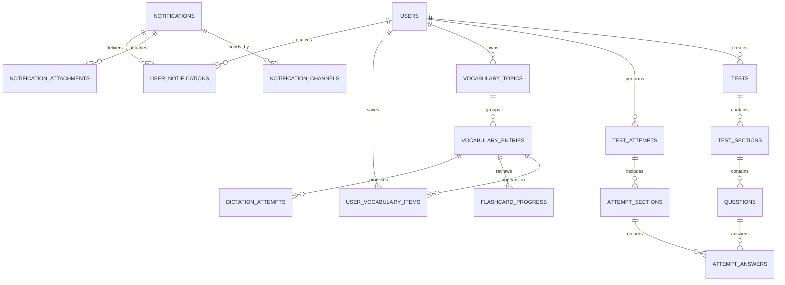

# AptiMate database

`schema.sql` là mô hình PostgreSQL thống nhất giữa tài liệu database ban đầu và frontend hiện tại. Đây là schema nguồn cho backend; frontend không nên tiếp tục coi `localStorage` là dữ liệu chính khi API được triển khai.

## Những điểm đã thống nhất lại

| Chức năng FE | Bảng chính | Quy ước |
|---|---|---|
| Đăng nhập, phân quyền | `users`, `roles`, `refresh_tokens` | Một user có một role; refresh/reset token chỉ lưu hash |
| Admin tạo bài test | `tests`, `test_sections`, `questions`, `question_media` | Reading/Listening/... dùng chung cấu trúc; Part nằm ở `test_sections` |
| Đáp án và giải thích | `questions.correct_answer`, `questions.explanation` | Một câu chỉ có một đáp án chuẩn và một payload explanation; không lặp nhãn đáp án trong text |
| Làm bài, lịch sử, chấm bài | `test_attempts`, `attempt_sections`, `attempt_answers` | Lưu câu trả lời từng câu; feedback AI và giáo viên tách riêng |
| Notebook | `vocabulary_topics`, `vocabulary_entries`, `user_vocabulary_items` | Topic hệ thống có `owner_user_id = NULL`; topic tự tạo thuộc user |
| Flashcard | `vocabulary_entries`, `flashcard_progress` | Không sao chép từ sang bảng flashcard; chỉ lưu trạng thái học của user |
| Dictation | `vocabulary_entries`, `dictation_attempts` | Entry loại `SENTENCE` dùng `dictation_text`; kết quả mỗi lần luyện được lưu riêng |
| Admin Notification | `notifications`, target/channel/attachment tables | Hỗ trợ Everyone, Role, Users; gửi ngay hoặc hẹn giờ; nhiều kênh và file |
| User Notification | `user_notifications` | Mỗi user có trạng thái delivered/read/clicked/deleted riêng |
| Feedback/Discussion/Chatbot | `feedback`, `component_discussions`, `discussion_replies`, `chat_sessions`, `chat_messages` | Không dùng số like lưu cứng; like là quan hệ user–discussion |

## Quan hệ quan trọng



## Luồng Topic → Notebook → Flashcard/Dictation

1. Khi user chọn **New topic**, backend tạo `vocabulary_topics` với `owner_user_id` là user hiện tại. Topic hệ thống như Daily life, Work... có `is_system = true` và không có owner.
2. Khi tạo **Word/Phrase**, backend thêm `vocabulary_entries`, rồi thêm `user_vocabulary_items`. Entry tự xuất hiện trong Notebook và Flashcard của đúng topic.
3. Khi tạo **Sentence**, backend lưu `entry_type = 'SENTENCE'`, `term` là tiêu đề và `dictation_text` là câu tiếng Anh. Entry tự xuất hiện trong folder Dictation của topic đó.
4. `flashcard_progress` và `dictation_attempts` chỉ lưu hoạt động của user, không nhân bản nội dung từ/câu.

Điều này thay thế các key FE hiện tại như `aptimate.dictation.customWords`, `customSentences`, `customTopics`, `flashcards` và `progress`.

## Luồng Notification

1. Admin tạo một record `notifications`.
2. Kênh Push/Email/In-app được thêm vào `notification_channels`.
3. Everyone không cần target phụ; Student/Teacher dùng `notification_target_roles`; gửi cá nhân dùng `notification_target_users`.
4. File được upload vào object storage, metadata nằm ở `media_assets`, liên kết qua `notification_attachments`. Không lưu base64 trong database.
5. Worker gửi ngay hoặc lấy các record `SCHEDULED` đến hạn, xác định người nhận rồi tạo `user_notifications`.
6. Header và trang Profile đọc cùng endpoint inbox; mở/xóa thông báo chỉ cập nhật `read_at`, `clicked_at`, `deleted_at` của user hiện tại.

## API tối thiểu cần triển khai

- `POST /auth/login`, `POST /auth/refresh`, `POST /auth/logout`
- `GET/POST/PATCH /admin/tests`, `.../sections`, `.../questions`
- `POST /tests/:id/attempts`, `PUT /attempts/:id/answers`, `POST /attempts/:id/submit`
- `GET/POST /vocabulary/topics`, `GET/POST /vocabulary/items`
- `POST /vocabulary/items/:id/flashcard-review`, `POST /vocabulary/items/:id/dictation-attempts`
- `GET/POST /admin/notifications`, `POST /uploads`
- `GET /me/notifications`, `PATCH /me/notifications/:id/read`, `DELETE /me/notifications/:id`

## Quy tắc backend cần giữ

- Mọi UUID do server sinh; mọi thời gian dùng UTC (`timestamptz`), FE đổi sang múi giờ người dùng.
- Không nhận `user_id`, `created_by` hoặc `owner_user_id` trực tiếp từ form; lấy từ access token.
- Với lịch gửi, backend bắt buộc `scheduled_at > now()`; gửi ngay để `scheduled_at = NULL`.
- Chỉ owner thấy topic/vocabulary `PERSONAL`; dữ liệu `SYSTEM` cho phép mọi user đọc.
- `correct_answer` và `explanation` chỉ trả về sau khi nộp bài hoặc trong màn hình review được phép.
- File thật nằm ở S3/MinIO/Cloud Storage; API trả signed URL ngắn hạn để xem và tải.

## Chạy schema

```bash
psql "$DATABASE_URL" -v ON_ERROR_STOP=1 -f database/schema.sql
```

Khi bắt đầu làm backend, nên dùng migration tool của framework và chuyển từng khối trong `schema.sql` thành migration có version; không để production tự chạy lại cả file này.
